# GNATS - Modern NATS Management GUI

[中文](README_zh.md)

GNATS is a modern, lightweight, and powerful open-source management interface designed for [NATS.io](https://nats.io). It provides an intuitive Web UI to help developers and operators easily manage NATS clusters, monitor real-time messages, configure JetStream, and operate KV stores.


---

## ✨ Core Features

- 🔌 **Multi-Connection Management**: 
    - **Single Active Connection**: Smart toggling system that automatically manages background resources when switching environments.
    - **Connection Editing**: Easily update existing configurations via a unified Modal interface.
    - **Advanced TLS**: Support for both file paths and direct PEM content pasting.
- 📊 **Account-Wide Monitoring**: 
    - **NATS Monitoring Integration**: Direct integration with NATS `/accstatz` and `/connz` endpoints for precise metrics.
    - **Multi-Account Selection**: Seamlessly switch between different NATS Accounts to monitor isolated traffic.
    - **Active Client Tracking**: Monitor Top 10 stressed clients with server-side sorting (by pending bytes, sent/received messages).
    - **Real-time Statistics**: Accurate throughput charts (msgs/s) and high-fidelity animations.
- 🚀 **Core Messaging (Pub/Sub & Request-Reply)**: 
    - Subscribe to subjects in real-time and view incoming messages.
    - Display advanced message details (auto-generated or custom `Reply-To` inbox, NATS headers as tags).
    - Publish messages with custom Payloads, Headers, and Reply-To addresses.
    - **Request-Reply Debug Panel**: Dedicated tab to send requests with timeout options and custom Reply-To subjects.
    - **Cancel Request**: Instant client-side aborting (via `AbortController`) that cancels context in the backend to safely release NATS resources.
    - **Advanced Subscription Options**: Configure Queue Groups, Max Messages (auto stop & unsubscribe), and Pending Limits (slow consumer protection) visually.
- 🌊 **JetStream Management**:
    - **Visual Distribution**: Charts showing message volume across top streams.
    - Create, view, purge, and delete Streams, with **purge confirmation refactored into a custom modal** for UI consistency.
    - **Metadata & Description Insights**: Access stream descriptions and custom Metadata key-values inside the details popup modal; customer details also show attached metadata tags.
    - **Real-time SSE Message Capture**: Capture stream messages in real-time using SSE (Server-Sent Events) with zero-delay modal opening. Support start/stop capturing toggle, auto-deduplication, max 200 message display limit, and live status breathing light (supports JSON/YAML formatting).
    - **Consumer Lifecycle Management**: Graphical creation of Push/Pull consumers (with durable names, descriptions, ack/deliver policies, ack wait, max deliver, and multi-subject filters), tabular list display (Name, Type, Pending, Ack Pending, Redelivered), delete operations, and full details popup Modal with no overflow.
- 🔑 **KV Store**:
    - Manage Buckets with configuration for TTL, history, and replicas.
    - **Bucket Metadata Display**: Render custom metadata in persistent badge/card format inside the status bar if metadata is configured.
    - **Professional Editor**: Integrated **CodeMirror 6** for high-performance value editing.
    - **Syntax Highlighting**: Real-time formatting and auto-indentation for JSON/YAML.
    - Easy CRUD operations for Keys.
- 📦 **Object Store**:
    - Support for bucket management and object lifecycle operations, **featuring persistent metadata display** like the KV store.
    - **Deep Object Details**: Expandable panels to view details including NUID, chunks, digest (hashes), description, and custom metadata.
- 🔍 **Service Discovery**:
    - Automatically discover and display services built with the NATS Micro framework.
    - **Enhanced Metadata Visibility**: Metadata tags are rendered directly on the service cards.
    - **Dual Detail Foldout Panels**: Asynchronously fetch `$SRV.INFO` and `$SRV.STATS` to display endpoints, endpoint metadata, descriptions, start times, average latency, request volume, error counts, and recent error stacks in an elegant panel with smooth custom hover tooltips.
- 📦 **Single Binary Distribution**: Frontend assets are embedded directly into the Go binary for zero-dependency deployment.
- 🌓 **Premium Experience**:
    - **Dark/Light Mode** automatic switching.
    - **Multi-language Support**: Full English and Chinese interface localization.
    - **Rich Tooltips & Modals**: Detailed connection info with network latency (RTT) and throughput analysis.
    - **Responsive Design**: Adapts to various screen sizes.

---

## 📸 Screenshots

### Dashboard


### Connection Management


### Core Pub/Sub
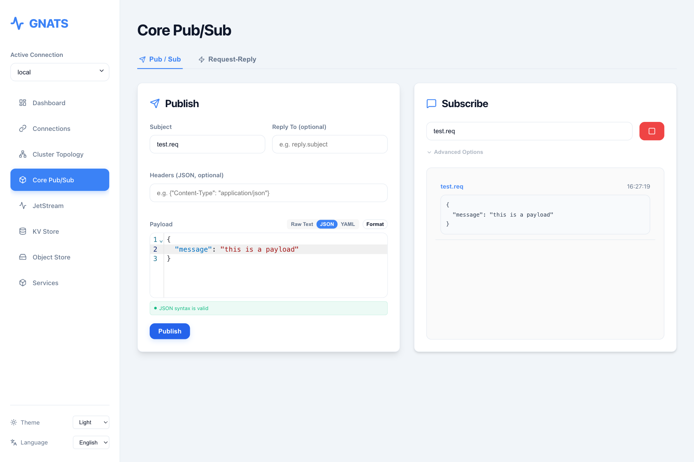
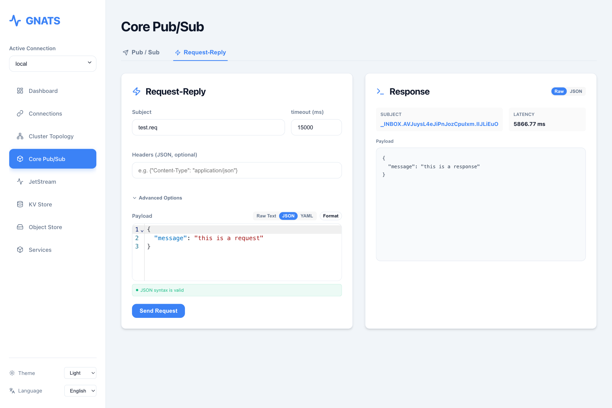

### JetStream
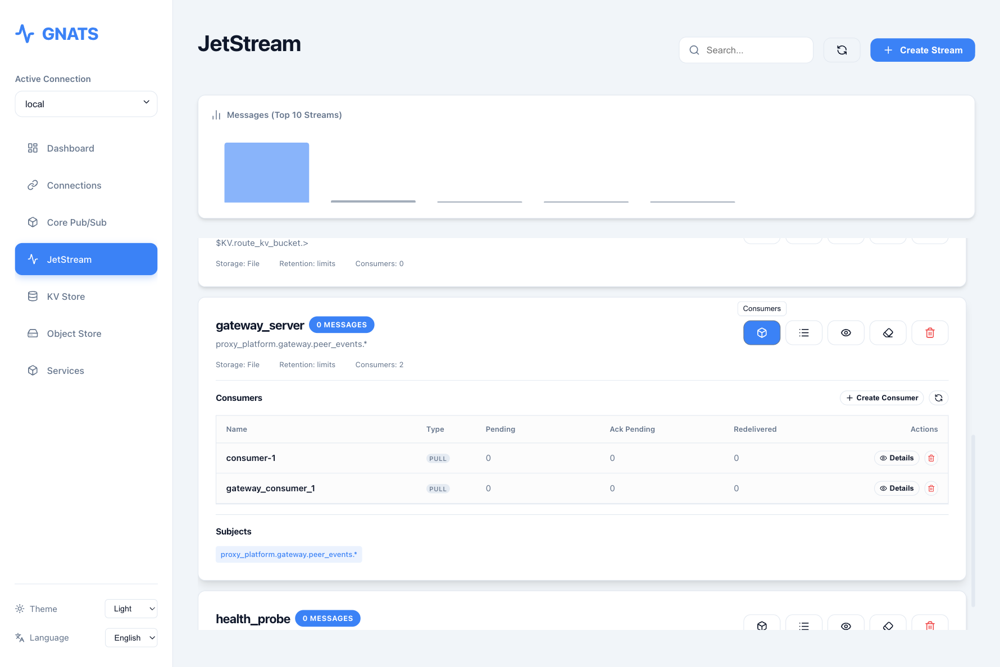
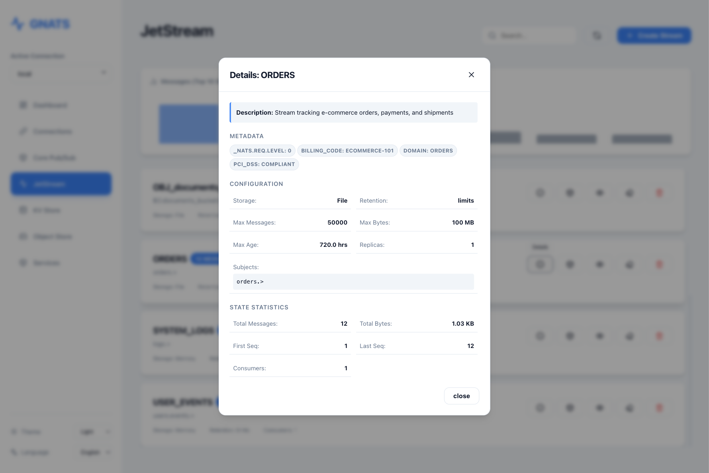
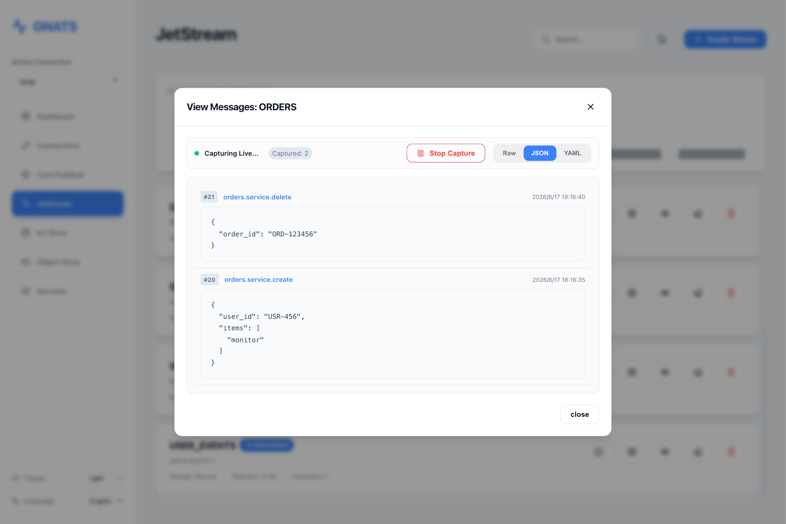

### KV Store
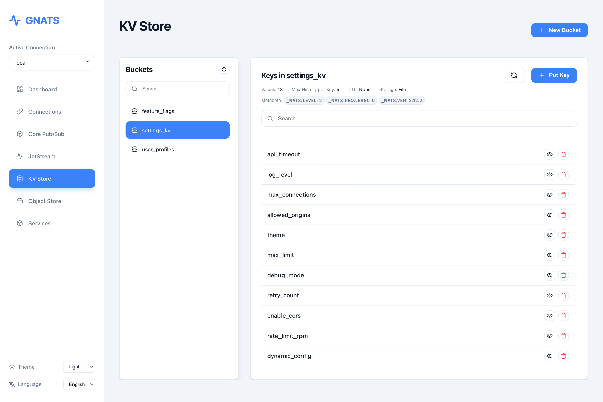
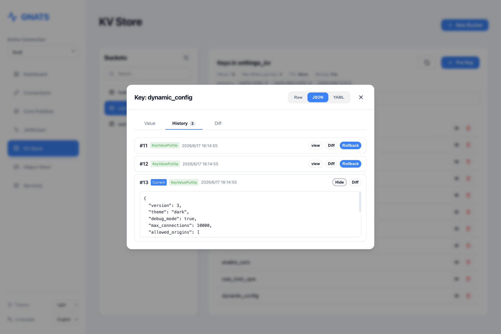
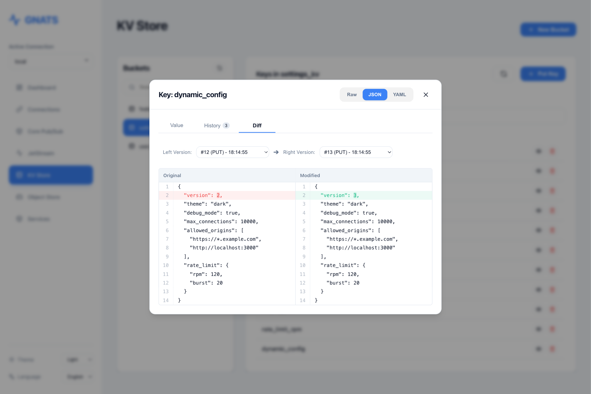

### Object Store
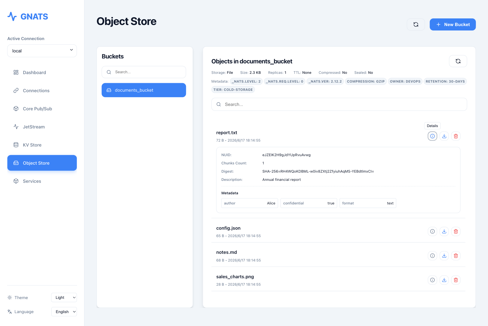

### Service Discovery
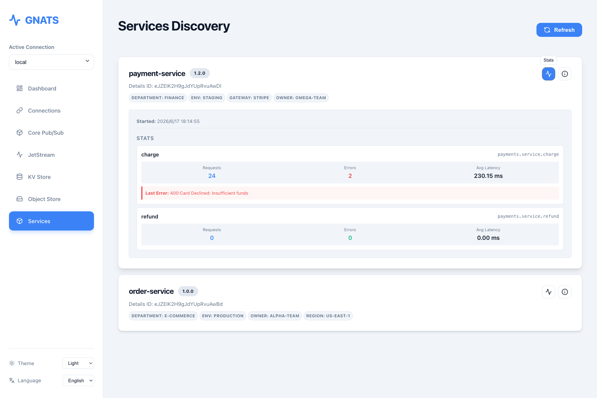
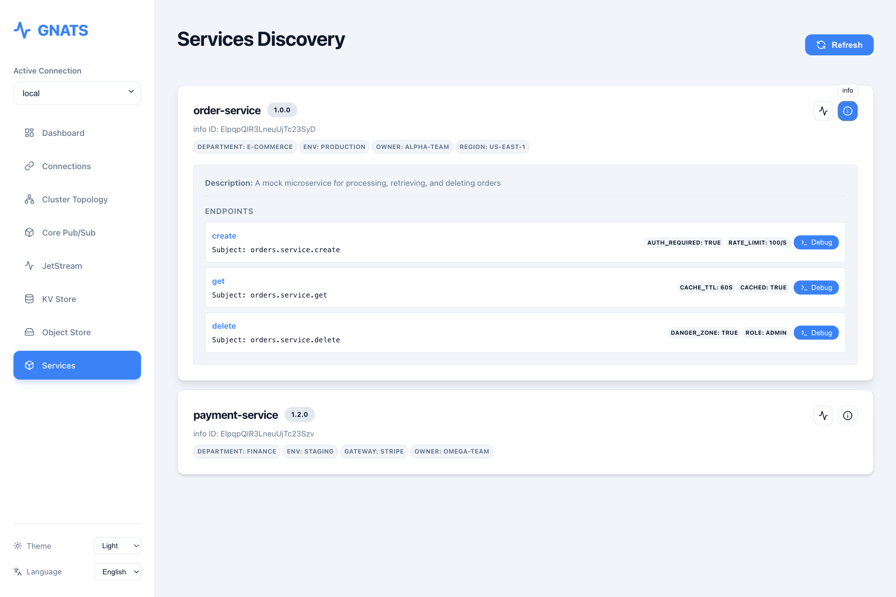

---

## ⚙️ Configuration

GNATS can be configured using environment variables:

| Environment Variable | Description | Default Value |
| :--- | :--- | :--- |
| `ADDRESS` | The bind address the Web UI will listen on (supports IP:PORT or :PORT). | `:8080` |
| `CONNECTIONS_FILE` | Path to save/load connection configurations. | `connections.json` |
| `DEBUG` | If set to `true`, serves static files from `ui/dist` instead of embedded files. | `false` |

---

## 🚀 Quick Start

### One-Click Cluster Evaluation (Docker Compose)

We provide a complete, ready-to-run multi-node environment demonstrating a 3-node NATS cluster, a Leaf Node (with local storage disabled to show core routing capabilities), the `gnats` Web Console, and a demo client traffic injector.

For details on the topology, logic, and how to verify, please see **[example/README.md](example/README.md)**.

1. **Start Environment**:
   ```bash
   docker compose -f example/docker-compose.yml up -d
   ```
2. **Access Web Console**: Visit **`http://localhost:8085`**
3. **Shutdown**:
   ```bash
   docker compose -f example/docker-compose.yml down
   ```

### Using Docker (Recommended)

The fastest way to get started. The image is extremely small as it only contains the single binary.

1. **Pull Image**:
   ```bash
   docker pull cesszlr/gnats:latest
   ```

2. **Run Container**:
   ```bash
   docker run -d -p 8080:8080 -v $(pwd)/data:/app/data -e CONNECTIONS_FILE=/app/data/connections.json --name gnats-app cesszlr/gnats:latest
   ```

3. **Access**: Open your browser and visit `http://localhost:8080`

### Build from source using Docker

1. **Build Image**:
   ```bash
   docker build -t gnats-gui .
   ```

2. **Run Container**:
   ```bash
   docker run -d -p 8080:8080 -v $(pwd)/data:/app/data -e CONNECTIONS_FILE=/app/data/connections.json --name gnats-app gnats-gui
   ```

### Local Development (No Docker)

1. **Build Frontend**:
   ```bash
   cd ui
   npm install
   npm run build
   cd ..
   ```

2. **Run Server**:
   ```bash
   go run cmd/gnats/main.go
   ```

3. **Run Test Data Simulator (Optional)**:
   We provide a simulator to populate NATS with mock data. See [cmd/demo/README.md](cmd/demo/README.md) for details.
   ```bash
   go run cmd/demo/main.go
   ```

---

## 🛠 Tech Stack

- **Backend**: [Go 1.26](https://golang.org/) + [chi](https://github.com/go-chi/chi) (RESTful API) + [nats.go](https://github.com/nats-io/nats.go)
- **Frontend**: [React 19](https://react.dev/) + [TypeScript](https://www.typescriptlang.org/) + [Vite 6](https://vitejs.dev/)
- **Visuals**: [Lucide Icons](https://lucide.dev/) + [Recharts](https://recharts.org/) + Vanilla CSS
- **i18n**: [i18next](https://www.i18next.com/)
- **Deployment**: `go:embed` + Docker Multi-stage Build (Single Binary)

---

## 🗺️ Roadmap

- [x] **Request-Reply Debugging Panel**: A dedicated interface for publishing messages and awaiting/rendering the response synchronously, with client-side cancellation.
- [x] **Consumer Lifecycle Management**: Graphical creation, detailed configuration, and operation of JetStream Consumers (including Push/Pull auto-detection).
- [x] **Key History & Rollback**: View historical revisions of KV keys and easily rollback to past versions.
- [x] **Key-Value Diff Viewer**: Visual side-by-side comparison of historical revisions for Key-Value entries.
- [ ] **NATS Cluster Multi-dimensional Topology & Monitoring**: Visual cluster topological maps showing RTT, bandwidth, and status of Leafnodes and cluster routes.
- [ ] **Microservices Debugging Panel Enhancement**: Active schema discovery via `$SRV.SCHEMA` and one-click endpoint invocation (API testing) directly in the service panel.
- [ ] **Payload Editor Syntax Highlighting & Formatting**: Integrated rich text editor with auto-formatting and JSON/YAML validation for messaging publishers.
- [ ] **KV Store Single Key Lifecycle Management**: Support configuring and previewing expiration/TTL settings for individual Key-Value entries.

---

## 📄 License

This project is licensed under the [Apache License 2.0](LICENSE).
