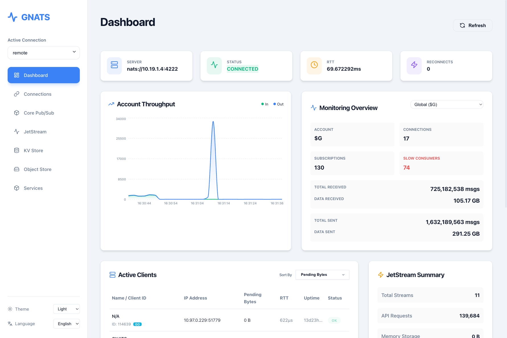
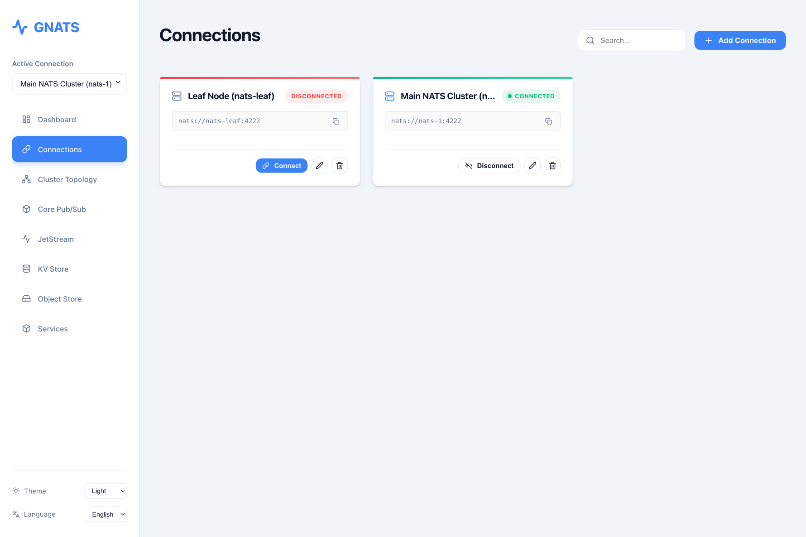
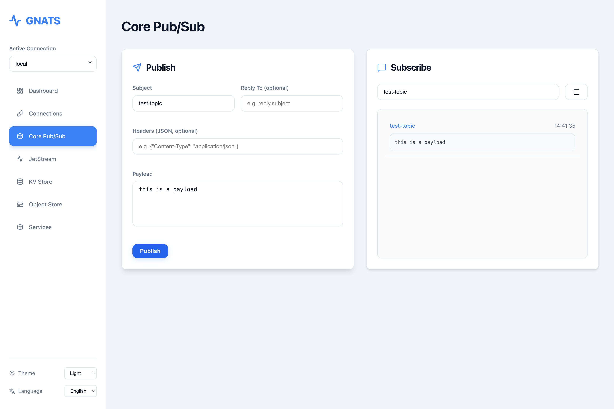
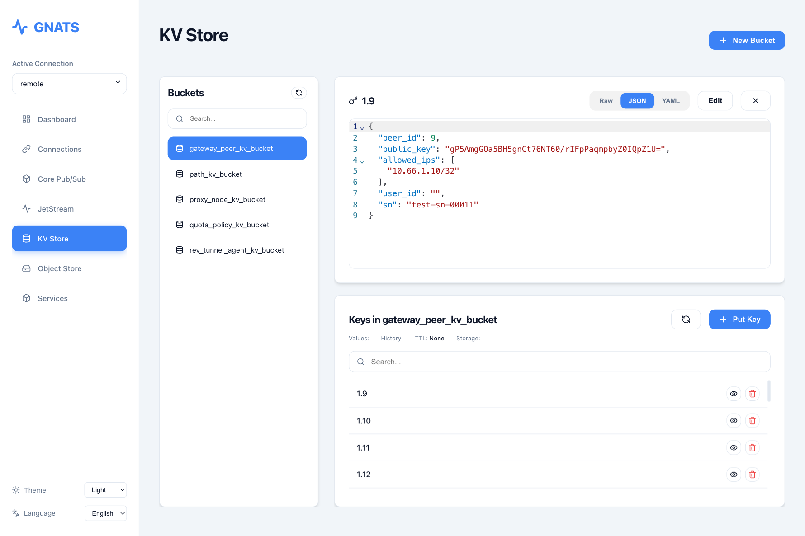

# GNATS - Modern NATS Management GUI

[中文](README_zh.md)

GNATS is a modern, lightweight, and powerful open-source management interface designed for [NATS.io](https://nats.io). It provides an intuitive Web UI to help developers and operators easily manage NATS clusters, monitor real-time messages, configure JetStream, and operate KV stores.


---

## ✨ Core Features

- 🔌 **Multi-Connection Management**: 
    - **Persistence**: Connection configurations are automatically saved to a local file.
    - **Quick Reconnect**: Easily switch between saved configurations.
- 📊 **Real-time Dashboard**: Quickly view server status, RTT latency, and JetStream statistics.
- 🚀 **Core Messaging (Pub/Sub)**: 
    - Subscribe to subjects in real-time and view incoming messages.
    - Publish messages with custom Payloads, Headers, and Reply-To addresses.
- 🌊 **JetStream Management**:
    - Create, view, purge, and delete Streams.
    - View message content in Streams in real-time (supports JSON/YAML formatting).
    - Monitor Consumer status and progress.
- 🔑 **KV Store**:
    - Manage Buckets with configuration for TTL, history, and replicas.
    - Easy CRUD operations for Keys.
- 📦 **Object Store**: Support for bucket management and object lifecycle operations.
- 🔍 **Service Discovery**: Automatically discover and display services built with the NATS Micro framework.
- 📦 **Single Binary Distribution**: Frontend assets are embedded directly into the Go binary for zero-dependency deployment.
- 🌓 **Premium Experience**:
    - **Dark/Light Mode** automatic switching.
    - **Multi-language Support**: Full English and Chinese interface localization.
    - **Responsive Design**: Adapts to various screen sizes.

---

## 📸 Screenshots

### Dashboard


### Connection Management


### Core Pub/Sub


### KV Store


---

## ⚙️ Configuration

GNATS can be configured using environment variables:

| Environment Variable | Description | Default Value |
| :--- | :--- | :--- |
| `PORT` | The port the Web UI will listen on. | `8080` |
| `CONNECTIONS_FILE` | Path to save/load connection configurations. | `connections.json` |
| `DEBUG` | If set to `true`, serves static files from `ui/dist` instead of embedded files. | `false` |

---

## 🚀 Quick Start

### Using Docker (Recommended)

The fastest way to get started. You can pull the pre-built image directly from Docker Hub:

```bash
docker pull cesszlr/gnats:latest
docker run -d -p 8080:8080 -v $(pwd)/data:/app/data -e CONNECTIONS_FILE=/app/data/connections.json --name gnats-app cesszlr/gnats:latest
```

### Build from source using Docker

3. **Access**: Open your browser and visit `http://localhost:8080`

---

## 🛠 Tech Stack

- **Backend**: [Go](https://golang.org/) + [chi](https://github.com/go-chi/chi) (High-performance routing) + [nats.go](https://github.com/nats-io/nats.go)
- **Frontend**: [React](https://react.dev/) + [TypeScript](https://www.typescriptlang.org/) + [Vite](https://vitejs.dev/)
- **UI Components**: [Lucide Icons](https://lucide.dev/) + Native CSS Variables (Modern Theme)
- **i18n**: [i18next](https://www.i18next.com/)
- **Deployment**: `go:embed` + Docker Multi-stage Build

---

## 📄 License

This project is licensed under the [Apache License 2.0](LICENSE).
